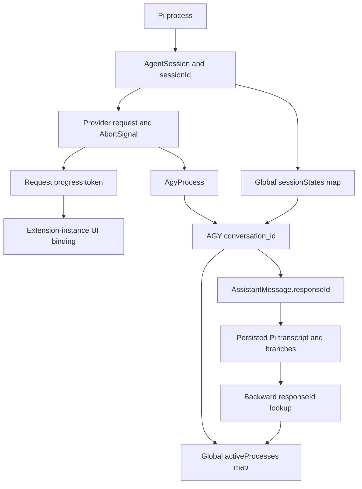

# v0.3.4 independent release audit

Audit date: 2026-09-25.

Target: released `v0.3.4`, commit
`752595c0c01188bbda0a922c7007623ed43de7ca`.

**Verdict: v0.3.4 does not pass this audit.** The official-AGY transport
architecture is present, and progress ownership has improved substantially.
Confirmed defects remain in system-prompt preservation, conversation isolation,
concurrency, subprocess lifecycle, and branch handling. No P0 issue was
established. P1 issues warrant correction before treating this release as reliable.

This report describes the release commit, not subsequent fixes. Source review and
adversarial probes were read-only. The user subsequently authorized adding this
report, committing it, and pushing it. No production fixes are included.

## 1. Baseline and evidence

| Check | Result |
| --- | --- |
| Development HEAD | `752595c0c01188bbda0a922c7007623ed43de7ca` |
| Release tag | `v0.3.4`, same commit |
| Development working tree during source audit | Clean before and after |
| Installed Pi Git package HEAD | Same commit |
| Installed package difference | Only the reported `package-lock.json` metadata drift |
| Node | `v24.20.0` |
| Pi | `0.87.1` |
| agy-pool | Previously recorded `0.1.0-beta.4+a310220` |
| Native AGY version and live CLI checks | ENVIRONMENT-LIMITED |
| Real gateway daemon | RUNNING, per the user's authoritative normal-SJC-shell verification |

The user independently verified daemon PID `3754721`, endpoint
`127.0.0.1:8899`, uptime of 6d 5h, four accounts, three Ready, one Restricted,
zero Cooldown, and strategy `max_quota`. The earlier read-only-environment
`STOPPED` result is not evidence about the real daemon. Daemon housekeeping,
startup, and other write-requiring runtime commands were not repeated.

The committed lockfile is stale relative to `package.json`: its root metadata
omits `engines` and retains the old `>=0.80.0` peer ranges instead of `*`.
The installed lockfile drift reconciles precisely those differences. Runtime
source matches the release commit; the installed working tree is not
byte-identical because of that lockfile difference.

### Verification history

During the original read-only audit:

- `npm run typecheck`: PASS.
- `git diff --check`: PASS.
- Eight read-only test files: **95 individual tests passed, zero failed**.
- Nine tests were ENVIRONMENT-LIMITED: six Pi/TUI integration tests and three
  mode tests require temporary directories. Filesystem writes were explicitly
  denied when attempting the full suite.
- `npm pack --dry-run --json`: ENVIRONMENT-LIMITED because npm attempted a
  cache write. A read-only invocation of npm's packlist implementation confirmed
  the nine-file package inventory below.

After the user authorized recording and pushing this report, the writable
environment allowed the required pre-commit checks to be rerun. Their final
results are recorded in the publication verification section at the end.
Offline tests use fake AGY transports; passing them does not establish native
CLI behavior or invalidate independently reproduced defects.

Relevant installed host Pi 0.87.1 implementation files for SDK dispatch,
provider composition, session lifecycle, extension runner/loader, and
TUI/print/RPC modes were byte-identical to the local copies reviewed. Review
covered implementations, not only declarations.

## 2. Historical issue reassessment

| Historical issue | Classification | Current evidence |
| --- | --- | --- |
| A. Direct Cloud Code transport | FIXED | No production direct-Cloud-Code transport found. |
| B. Thinking-level support | FIXED | Pi reasoning options reach official CLI `--effort`; native capability checks remain environment-limited. |
| C. Progress blackout | FIXED | Requests immediately publish `AGY: Working…`; tool/subagent activity updates the TUI footer. |
| D. Unsafe/global progress ownership | FIXED | UI binding is extension-instance scoped; callbacks and tokens are request scoped. Global transport state is a separate concern. |
| E. Pi compaction bypass | PARTIALLY FIXED | Successful compaction requests a fresh conversation, but bootstrap integrity and complete process retirement are defective. |
| F. Same-session concurrent duplicate process | STILL PRESENT | Two simultaneous requests with the same session ID can spawn two children. FIFO has a separate ordering defect. |
| G. Host signal ownership | PARTIALLY FIXED | Unconditional host exit is removed, but signal listeners still change host behavior. |

## 3. Severity-ranked findings

### P0

None established.

### P1-1: Normal Pi 0.87.1 system instructions are omitted

Source: [`extractAuthoritativeSystemPrompt`](src/stream.ts), around line 242.

The adapter reads `context.systemPrompt` and
`contentText(systemMessage.content)`. Actual Pi 0.87.1 normally represents its
system prompt as:

```ts
{ role: "system", content: "", sections: { /* instructions */ } }
```

Sections contain the preamble, rules, project instructions, skills, working
directory, and other prompt material. The adapter does not read them.

A probe using Pi's actual `buildSystemPromptState` and `normalizeContext`
constructed a context containing a project guardrail. Pi's renderer retained
it; `buildTurnPrompt` produced only `hello`.

This affects initial conversations and post-compaction bootstraps. Later system
updates are also omitted by the resumed path, which forwards only the latest
message text.

### P1-2: Conversation IDs lack provider, session, and branch validation

Source: [`findConversationId` and process reuse](src/stream.ts), around lines
277 and 743.

Any assistant `responseId` is accepted regardless of provider/API. Reuse looks
up a global process using only that conversation ID.

Confirmed examples:

- An OpenAI assistant message with `responseId: "resp_foreign"` is accepted
  as an AGY conversation.
- Different Pi session IDs sharing historical AGY response IDs can reuse one
  live process.
- That reuse does not establish the second session as the process owner.

A concrete fork hazard exists after restarting Pi: before a resumed session
makes a new AGY request, its in-memory active-conversation state is empty.
Fork retirement cannot retire its historical ID. A fork retaining that ID can
resume the native conversation, including native history beyond the fork point.

An AGY conversation ID identifies a mutable conversation, not a Pi branch
checkpoint.

### P1-3: Branch-summary bootstrap discards retained target history

Source: [`isCompactionMessage` and `buildTurnPrompt`](src/stream.ts), around
lines 153 and 380.

Branch summaries are treated as compaction boundaries. Bootstrap then drops
preceding non-system messages. Pi's branch summary describes the abandoned
branch; it does not replace the retained target branch.

Reproduced using actual Pi `SessionManager.inMemory`, `branchWithSummary`, and
`convertToLlm`:

```text
Pi projection: retained target history → abandoned-branch summary → request
AGY bootstrap:                          abandoned-branch summary → request
```

The target history remained in Pi and disappeared from AGY's prompt.

### P1-4: Early init can be lost, leaving a child untracked

Source: [startup and conversation binding](src/stream.ts), around lines 763–817.

The ordering is:

```text
spawn → await onPayload → attach runTurn listener → write after ready
```

`AgyProcess.ready` handles `init` independently, but conversation binding,
`responseId`, and process registration require the later turn callback to
receive the same event.

In a fake-transport probe, `init` arrived while an asynchronous payload hook was
held pending. The completed request had no `responseId`, `activeProcesses.size`
was zero, global cleanup sent no signal to the child, and fallback text events
appeared without `start`.

Actual Pi supplies an asynchronous payload hook. A delayed hook makes this a
real ordering hazard.

### P1-5: Acquisition and FIFO do not guarantee one active turn

Sources: [process acquisition](src/stream.ts) and
[`AgyProcess.runTurn`](src/agy-process.ts), around line 208.

There is no session-keyed acquisition reservation before `init`. Two requests
with the same session ID and no usable response ID spawn two processes.

Separately, the queue bypass starts a request immediately whenever `_isBusy`
is false, even if earlier requests remain queued. Reproduction:

```text
Submit A, B
Receive A result
Submit C before B's queued continuation executes
Written order: A, C, B
Two result records settle all three requests
```

One native result can consequently resolve multiple Pi requests. Cancelling a
queued request also aborts the shared process, affecting the active request.

### P1-6: Broken stdin can crash Pi

Source: [stdin write](src/agy-process.ts), around line 342.

The write has a callback, but child stdin has no `error` listener. A Node
`Writable` reporting `EPIPE` through its callback also emits an error event.
An in-memory reproduction terminated its Node process with:

```text
Unhandled 'error' event
Error: audit simulated EPIPE
```

Handling `ChildProcess.error` does not handle `child.stdin.error`.

### P1-7: Cleanup misses children and an old exit can erase a replacement

Sources: [retirement and registration](src/stream.ts), around lines 62 and 800,
and [`AgyProcess.kill`](src/agy-process.ts).

Confirmed gaps:

- Busy retirement waits for `result` and sends no cancellation signal.
- Children before registration are absent from cleanup maps.
- Pi's actual compaction summarizer creates a fresh routing session ID. Its
  completed AGY process remains cached; retiring the main session does not
  retire that process.
- Model/effort replacement can bind a new process to the same conversation
  ID before the old child exits. The old exit callback unconditionally deletes
  that ID.

The replacement race was reproduced: a new high-effort process was registered,
then disappeared from the map when the old child exited.

`kill()` sends SIGTERM without awaiting termination or escalating. Shutdown
does not establish that all owned children have terminated.

### P1-8: AGY does not receive the Pi session cwd

Source: [`new AgyProcess`](src/stream.ts), around line 764.

`AgyProcess` supports `cwd`, but its production caller never supplies it. Pi
supports sessions with a cwd different from the host process, including switches
with `cwdOverride`. AGY therefore starts in the host cwd, not necessarily the
active workspace.

Autonomous file and shell tools make this a meaningful wrong-workspace risk.
The extension also does not forward provider-scoped `options.env`.

### P1-9: Pi's default retry policy can replay autonomous generation

The extension has no retry loop, but exposes raw native errors to Pi. Actual Pi
0.87.1 enables automatic retries by default. Its retry classifier accepted:

```text
AGY process exited with code 1: service unavailable
```

Pi can issue a new provider request without knowing whether AGY already
executed tools or committed generation work.

This is a host-integration replay risk, not evidence that `agy-pool-go` violates
its own per-request no-replay policy. The overall integration cannot currently
claim that guarantee.

### P2

| ID | Finding | Evidence and effect |
| --- | --- | --- |
| P2-1 | Startup and dead-stream promises can stay pending | `ready` is not rejected on clean or signal exit before init. Stdout EOF without result does not fail a live child's turn. Hanging payload hooks delay abort propagation. |
| P2-2 | Queued cancellation can strand the active request | With no child exit notification, queued abort rejected the queued request while the active request remained pending after escalation. |
| P2-3 | Host signal semantics remain altered | One-shot SIGINT/SIGTERM listeners suppress Node's default action where the host has no handler. Cleanup affects all tracked sessions; normal shutdown/reload does not remove hooks. |
| P2-4 | Usage is incomplete/inconsistent | `cache_read_tokens` is ignored. Terminal input/output can replace earlier values while an old nonzero total survives. Probe: input 20, output 3, total 12, cacheRead 0 despite terminal cache read 7. |
| P2-5 | Stream/callback contracts are incomplete | Result-only reused turns can omit start. `onResponse` fires on init, not every request, fabricates HTTP 200, and ignores returned promise rejection. |
| P2-6 | User text can falsely trigger compaction | An ordinary message containing the compaction phrase becomes a boundary; fresh bootstrap discards preceding history. |
| P2-7 | Additional projected context is lost | Resume sends only the latest text. Compacted bootstrap explicitly skips retained toolResult messages. |
| P2-8 | Diagnostics bypass sanitization | Stderr tails/native error strings reach `AssistantMessage.errorMessage` unchanged. Paths, IDs, or sensitive diagnostics may be exposed; no actual credential disclosure was observed. |

The false-compaction risk is practical when quoting summaries, discussing
compaction, or pasting logs. It requires a fresh-bootstrap path to produce the
demonstrated truncation.

### P3

| ID | Finding | Assessment |
| --- | --- | --- |
| P3-1 | Stale committed lockfile | Confirmed root metadata inconsistency; no dependency-graph break established. Explains installed checkout drift. |
| P3-2 | Decoder's "4 MB" limit uses UTF-16 code units | String length is not UTF-8 byte length. The bound is finite but inaccurately described. |
| P3-3 | Compatibility assurance is narrower than declared support | Actual verification covers Pi 0.87.1; the full advertised >=0.80.0 range is unverified. Private-path tests are version-sensitive. |

## 4. Runtime architecture and module review

```text
Pi AgentSession
→ composed agy-pool provider
→ streamSimple
→ AgyProcess
→ spawn("agy-pool", ["run", "--", ...])
→ official native AGY
→ agy-pool-go configured gateway
→ account scheduling / OAuth / quota / failover
→ Google
```

Production searches found no direct Cloud Code HTTP/SSE implementation, OAuth,
account scheduling/rotation, wire-model translation, `thinkingBudget`,
`thoughtSignature`, or direct native executable invocation. README's historical
or architectural references are not production violations.

The inspected external `agy-pool-go` source sets up integration and uses
`syscall.Exec` to replace the wrapper with native AGY. It was read only. Live
binary equivalence and E2E routing were not exercised.

Every shipped runtime module was reviewed:

| Module | Responsibility and mutable ownership | Assumptions, failures, cleanup |
| --- | --- | --- |
| [index.ts](src/index.ts) | Registration entry and exports; no mutable state | Uses Pi's documented loader; no independent lifecycle. |
| [models.ts](src/models.ts) | Shared exported model catalog | Assumes native names/limits. VERIFIED_MODELS aliases MODELS; it performs no verification. |
| [provider.ts](src/provider.ts) | Per-registration binding and request-token map; lifecycle hooks | Progress ownership is sound under normal bindings; transport cleanup delegates to incomplete global state. |
| [agy-events.ts](src/agy-events.ts) | Per-process UTF-8 decoder and NDJSON buffer | Handles normal fragmentation/malformed lines; overflow is fatal and schema validation is shallow. |
| [agy-process.ts](src/agy-process.ts) | Child, ready promise, queue, busy/alive/aborted flags, stderr tail | Separate busy and queue state permits concurrency errors; stream error/terminal lifecycle handling is incomplete. |
| [stream.ts](src/stream.ts) | Projection, process selection, stream/usage mapping, progress, global identity maps | Conflates transcript IDs, conversation ownership, and routing. Cleanup covers registered processes; historical sets accumulate. |

The main unnecessary coupling is in `stream.ts`: caching, invalidation,
projection, session fallback, and signal ownership share module state.
`AgyProcess` has two scheduling authorities, its busy flag and promise queue,
which disagree in the FIFO reproduction.

## 5. State and identity



Transcript lookup can directly select a global live process. Neither responseId
nor native session_id proves ownership by the current Pi session/branch.
`currentSessionId` is another global fallback. Ordinary Pi requests provide
explicit routing IDs; direct callers without them remain ambiguous.

| Operation | Current behavior |
| --- | --- |
| New session | Usually fresh; concurrent acquisition can duplicate children. |
| Resume/continue | Uses historical response IDs without provider/branch provenance. |
| Fork | Retirement helps if the parent's active ID is known; restart-before-first-request remains unsafe. |
| Tree | Marks current conversation stale; branch-summary bootstrap drops target history. |
| Successful compaction | Marks main session for bootstrap and retires its known conversation. |
| Failed/cancelled compaction | No successful-compaction reset, appropriately; one-off summary cleanup remains incomplete. |
| Repeated compaction | A→B→C can work through hooks, subject to binding and projection defects. |
| Model/effort change | Replaces process using --conversation; old-exit deletion race remains. |
| Reload | Pi emits shutdown and invalidates runner; global hooks/child coverage remain incomplete. |
| Shutdown | Invalidates progress but does not reliably terminate every associated child. |

## 6. Actual Pi API compatibility

| API/behavior | Verified semantics |
| --- | --- |
| registerProvider | Queued while loading, applied by runner. Re-registration merges defined fields and recomposes. |
| composeModelProvider | Selects extension streamSimple for matching API and forwards options. |
| SimpleStreamOptions | Carries reasoning, session ID, abort, callbacks, and environment; adapter ignores several optional fields. |
| AssistantMessageEventStream | First terminal event resolves result; later pushes ignored. Does not prevent upstream wrong-turn resolution. |
| ExtensionContext | Lazy mode/ui/session getters consult live runner and reject stale contexts; progress uses this correctly. |
| session_start | Binds progress, not native ownership. |
| session_before_switch / session_before_fork | Run before cancellation decisions; retirement also happens for cancelled operations. |
| session_tree | Runs after Pi replaces its projection. |
| turn_start / turn_end / agent_end | Actual lifecycle events; extension binds at turn_start and clears via request settlement. |
| before_provider_request | Awaited through payload callback, exposing startup-ordering race. |
| session_before_compact / session_compact / session_compact_failed | Success emits session_compact after append; failure is separate. Extension handles success only. |
| setStatus | Updates footer state and schedules render. |
| setWorkingMessage / setWorkingVisible / setWorkingIndicator | Exist; v0.3.4 does not use them. |
| TypeScript loading | Documented Pi jiti behavior, not an undocumented packaging dependency. |

Provider registration is structurally valid: provider `agy-pool`, API
`agy-pool-api`, placeholder base URL `agy-pool`, dummy key `none`,
`authHeader: false`. The placeholder is not used for HTTP generation. Entry point
and exports resolve to shipped files. Production imports use public Pi APIs.

## 7. Models and thinking

| Model | Pi thinking | Picker levels | AGY effort | Adapter default | Context / max output |
| --- | --- | --- | --- | --- | --- |
| gemini-3.8-flash | yes | low, medium, high | same value | medium | 1,048,576 / 65,536 |
| gemini-3.7-flash | yes | low, medium, high | same value | medium | 1,048,576 / 65,536 |
| gemini-3.6-flash | yes | low, medium, high | same value | medium | 1,048,576 / 65,536 |
| gemini-3.1-pro | yes | low, high | same value | high | 1,048,576 / 65,535 |
| claude-sonnet-4-6 | no | off | omitted | omitted | 250,000 / 64,000 |
| claude-opus-4-6-thinking | no | off | omitted | omitted | 250,000 / 64,000 |
| gpt-oss-120b-medium | no | off | omitted | omitted | 131,072 / 32,768 |

Pi's parser supports `model:high` and `--thinking`. Unsupported Flash levels
clamp toward low/high; Pro medium becomes high; Claude/GPT-OSS clamp to off.
Here reasoning=false means no selectable Pi effort, not absence of native
reasoning. Model/effort replacement intends to preserve continuity through the
native conversation argument, subject to the lifecycle defects above.

Explicit reasoning takes precedence over `AGY_POOL_EFFORT`. The environment
setting is therefore a fallback despite README calling it an override. Normal
Pi requests commonly supply a reasoning level.

Native acceptance of all seven IDs, effort restrictions, token limits, and
native continuity across model changes remains ENVIRONMENT-LIMITED. Binary
strings are insufficient proof. No Cloud Code behavior was substituted for
native CLI verification.

## 8. Transport, parser, promises, and stream semantics

- Spawn uses argument arrays, default shell=false, JSON stdin, and separated
  stdout/stderr. No shell interpolation was found.
- A prompt write ignores the boolean backpressure return; Node buffers it.
  This alone does not prove dropped bytes. Queue defects can allow multiple
  outstanding turns.
- Ordinary turn settlement removes turn listeners. Abort timeout retains its
  exit listener until eventual exit. Global hooks lack normal disposal.
- Ordinary result/error paths settle once. Startup, EOF, hanging hooks, and
  unresponsive-child cancellation have the pending cases described above.
- Split UTF-8, LF/CRLF, multiple/partial records, empty lines, malformed JSON,
  and trailing EOF records are handled. Ordinary malformed JSON does not poison
  following valid lines.
- Overflow clears the buffer and aborts production execution. Valid records in
  the same failing batch may be lost. This is fail-fast, not recovery.
- There is no explicit decoder reset after overflow; production invalidates
  the process instead of reusing it.
- Validation requires an event string but does not comprehensively validate
  protocol fields. Unknown event types are not mapped to answer/tool content.
- Only agent_response or legacy untyped text deltas enter answer content.
  Typed tool/subagent/system telemetry is excluded.
- Result.response is fallback only when streamed text is absent; no duplicate
  text was found.
- Result-only reused turns can omit start; normal text turns emit
  start → text_start → text_delta* → text_end → done.
- Pi terminal uniqueness holds, but a result received before cancellation can
  complete successfully. Queue misrouting is a separate defect.
- Step usage replaces earlier fields rather than accumulating. Whether every
  native step is cumulative is unverified. Error-result terminal usage is lost
  because runTurn rejects before final usage mapping.
- Abort invalidates a process for reuse, but historical conversation IDs can
  remain in output/transcript. No native rollback guarantee was established.
- Model/effort changes while work is queued kill the mismatched process;
  pending work is not preserved as a session-level FIFO.

## 9. Progress and non-interactive modes

```text
AGY telemetry → request-local activity map → request token in TUI binding
→ setStatus("agy-pool", label) → Pi footer → scheduled rendered frame
```

The newest overlapping request owns the row; older requests cannot clear it.
When it settles, remaining request status is restored. Fixed tool descriptions
and allowlisted subagent roles keep arbitrary telemetry strings out of progress.
Subagent prompts, commands, parameters, file content, log URIs, and conversation
IDs are not echoed by progress formatting.

ACTIVE→DONE retains a completion label across empty agent updates. Text and
terminal completion clear it. Pi coalesces rendering, so setter calls do not
prove every intermediate label appeared. A completed label survives for a later
frame unless text/completion supersedes it. No surviving module-global progress
callback was found.

Actual Pi implementations expose print, json, and rpc contexts. The explicit
TUI guard prevents normal progress publication there. No production stdout
logging or telemetry-to-Pi ToolCall/toolcall_* / toolUse path was found. Native
AGY executes tools and subagents; Pi does not execute telemetry a second time.

The original real-frame/mode tests were environment-limited; subsequent offline
publication verification is recorded below. Live native execution remains
unverified. Lifecycle failures can affect termination independently of output
formatting.

## 10. Compaction and bootstrap integrity

The successful-compaction hook marks the known old conversation stale. The next
request should omit --conversation, bootstrap the compacted Pi projection, bind
a fresh init ID, and resume that ID on later turns. Stale response IDs are
filtered using in-memory retirement sets and summary timestamps.

Important limits:

- Plain textual system strings are deduplicated; structured sections are lost.
- Ordinary fresh-history formatting generally includes messages once.
- Genuine compaction projections avoid reintroducing removed prefixes.
- Branch summaries and user-text false positives incorrectly remove retained
  history.
- Compacted bootstrap drops retained Pi tool results.
- Resume forwards only the last message text.
- User:/Assistant: flattening has no structural role separation; quoted text
  can imitate those delimiters.
- Provider context has already converted summary metadata into user text;
  typed provenance should be taken from available lifecycle/session projection
  APIs rather than broad substring matching.
- Progress and typed tool/subagent telemetry do not enter answer content,
  session transcript, compaction summary, or future bootstrap through the
  normal telemetry path. Native model-authored answers can independently
  include tool-derived information.

## 11. Permissions, cancellation, and liveness

README documents unconditional --dangerously-skip-permissions and autonomous
file/shell execution. No extra sandbox, cwd confinement, environment filtering,
or process-tree containment is implemented here. Native tools operate with the
child's OS permissions; shell tools can access home files, git, and network when
the surrounding environment allows it. --disable-slash-commands is not
confinement.

AGY_POOL_BIN/PATH choose the executable; argv and JSON prompt transport avoid
shell interpolation. No new credential-handling implementation was found.
Actual native tool availability, approval behavior, and descendant cleanup
remain ENVIRONMENT-LIMITED. Missing session cwd is a concrete exposure, distinct
from documented intentional autonomy.

Cancellation before spawn is checked. During a normal turn, abort sends SIGINT,
marks the process invalid, and attempts SIGKILL after three seconds. Cancellation
while the payload hook waits does not promptly reach the child. Global and
session cleanup miss the lifecycle cases in P1-7. TUI Ctrl+C input handling and
an OS SIGINT are distinct; the extension still installs host signal listeners.

| Liveness case | Assessment |
| --- | --- |
| Spawned, never initializes | No startup deadline; waits for abort or handled failure. A configurable startup-only limit is reasonable. |
| Initialized and legitimately working | No arbitrary turn timeout; appropriate for long native work. |
| Broken or indefinitely silent | EOF/pipes/exits should settle immediately. Silence alone cannot distinguish legitimate work from dead execution without native liveness support. |

A short global generation timeout is not recommended.

## 12. Packaging and dependencies

The package inventory is exactly nine files:

```text
LICENSE
README.md
package.json
src/agy-events.ts
src/agy-process.ts
src/index.ts
src/models.ts
src/provider.ts
src/stream.ts
```

Tests, lockfile, AGENTS.md, audit report, and CI configuration are excluded by
the package manifest. Installed lockfile drift does not alter runtime contents.
LICENSE is MIT; exports/main/pi.extensions all point to the shipped TypeScript
entry. Pi documents loading TypeScript extensions with jiti.

Private dist-path imports occur in the test harness, where real implementation
behavior is inspected; they are version-sensitive, not production imports.
Inspected local Pi library copies were 0.87.1. Pi documents wildcard peers and
host-module resolution, so '*' itself is not a packaging defect. The declared
minimum Pi compatibility range has not been independently established.

The release workflow is tag-only, checks exact package-version equality before
packing, runs tests/typecheck, inspects the tarball, and publishes through GitHub
Releases. No npm publication or branch-triggered production release path was
found. The already-published remote asset and its build provenance were not
independently downloaded or attested.

## 14. Ordered correction plan

1. Preserve actual Pi projected system state and transcript. Handle sections
   and updates through public semantics; separate branch summaries from
   compaction and retain target history/tool results.
2. Establish process ownership before spawning. Validate response provenance,
   propagate session cwd, and start fresh when branch ownership is ambiguous.
3. Fix startup/terminal lifecycle: bind identity from ready independently of
   turn events, propagate abort during payload hooks, handle stdin errors, and
   settle definitive EOF/exit.
4. Use one FIFO authority for acquisition and turns. Remove the busy-flag
   bypass; ensure queued cancellation cannot strand or misroute other work.
5. Complete cleanup for busy, unregistered, and one-off summary processes.
   Await/escalate termination and delete map entries only if still owned by
   the exiting process.
6. Resolve host retry semantics so a possibly committed autonomous request
   cannot be replayed automatically. Do not add account rotation or another
   extension retry layer.
7. Correct stream starts/callback rejection, cache usage/coherent totals, and
   user-facing diagnostic handling.
8. Reconcile lockfile metadata and document compatibility, environment
   precedence, and decoder size units accurately.
9. After fixes, run the full offline suite and tarball inspection, plus
   separately authorized native CLI/E2E checks for all models, cancellation,
   compaction, forks, tree navigation, and cleanup.

## 15. Publication verification

The report-only commit does not fix or change the audited runtime. Writable
offline verification on 2026-09-25 allowed npm's cache and isolated test scratch
directories; no live AGY generation or daemon-management command was run.

- `npm run typecheck`: PASS.
- `npm pack --dry-run --json`: PASS; nine files, 68,273 unpacked bytes.
- `npm test`: PASS; **104 tests, eight suites, zero failures, zero skipped**.
  This includes the six real-Pi/TUI and three non-interactive-mode tests that
  were environment-limited during the original read-only run.
- `git diff --check`: PASS.
- `git status --short` before staging: only the new `AUDIT.md`.

These passing checks resolve the original offline-test and package-dry-run
environment limits. They do not resolve the adversarial findings or establish
native CLI/E2E behavior.
